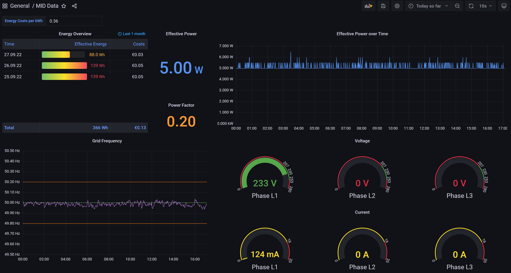
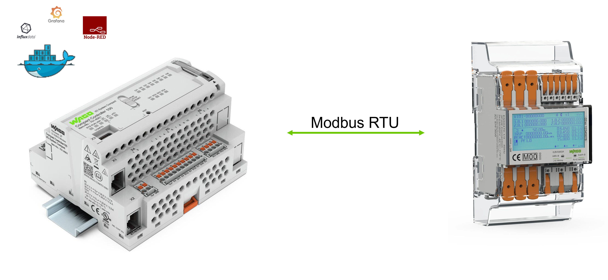
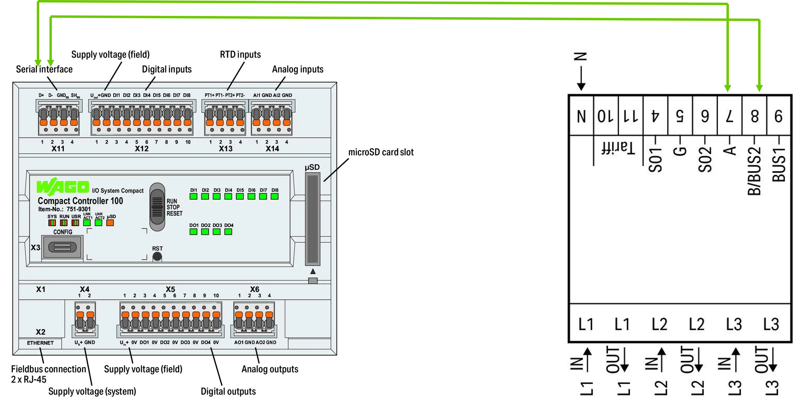
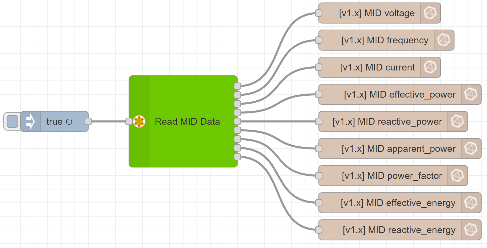
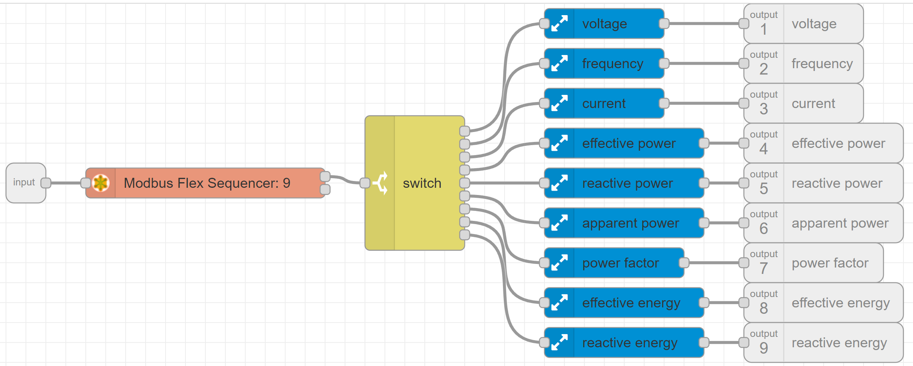
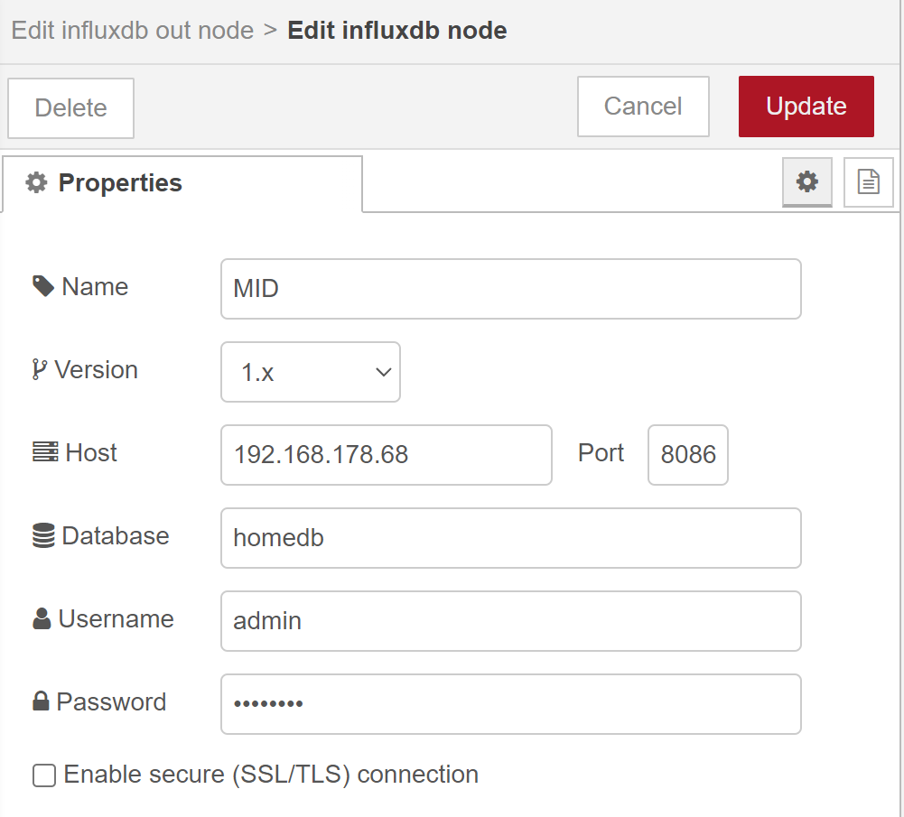
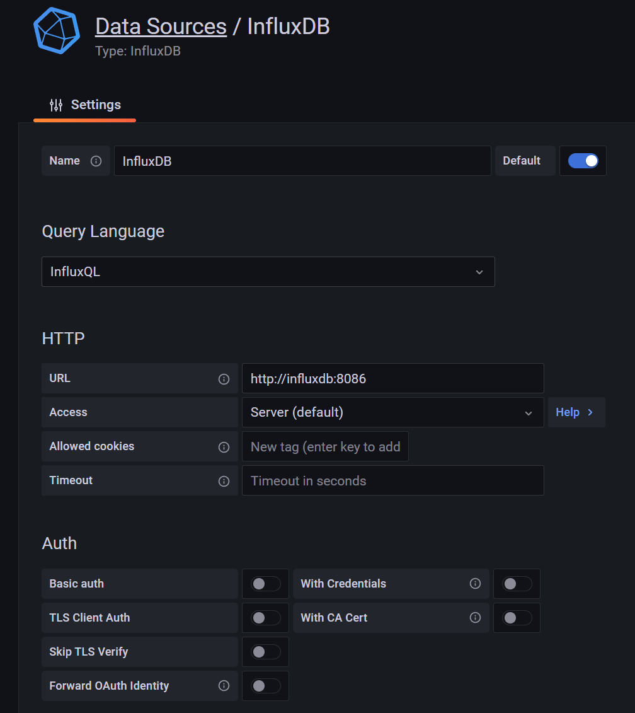
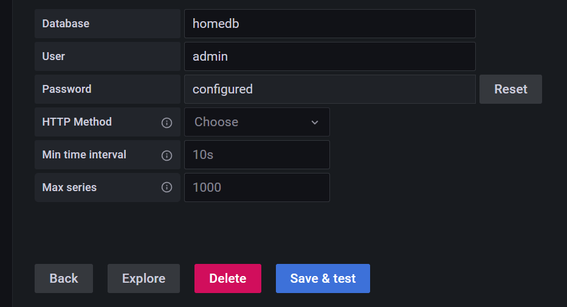

# cc100-energy-dashboard
This repository shows the implementation of an energy dashboard on the WAGO CC100 using several Docker containers (Node-RED, InfluxDB and Grafana). The WAGO energy meter (MID) is used as an example source for the energy data.

## Prerequisites
* WAGO CC100 (751-9301) 
    - install docker and move docker "DATA-ROOT" to an inserted SD card
    - see [cc100-tutorial](https://www.youtube.com/watch?v=ZIcp3H0h6q0) for help
    - [docker-ipk](https://github.com/WAGO/docker-ipk)
* WAGO Energy Meter (MID) (e.g. 879-3000)
* for firmware download or update see [cc100-firmware](https://github.com/WAGO/cc100-firmware)
* PC with preinstalled SSH Client (e.g. [PuTTY](https://www.putty.org/))
* Web browser of your choice. (e.g. chrome)

> Follow the [cc100-serial-communication repository](https://github.com/WAGO/cc100-serial-communication) for better understanding

## Setup
The idea is to use the CC100 to read energy data from the MID via Modbus RTU and display it on a Grafana dashboard. For this purpose, containers with Node-RED, InfluxDB and Grafana are set up on the CC100. For higher performance, the containers with InfluxDB and Grafana can be outsourced to an edge computer.

Connect the terminals X11.1 and X11.2 of the CC100 with the terminals 7 and 8 of the MID

## CC100 Login
Start SSH Client e.g. Putty 
<pre><code>login as 'root'
password 'wago'
</code></pre>

## Check docker installation
<pre><code>docker info
docker ps           # lists all running containers (no container should run)
docker images       # lists all preinstalled images
</code></pre>

## Create Network
<pre><code>docker network create monitoring
</code></pre>
<pre><code>docker network ls        # lists all networks
</code></pre>

## Start containers
1. Node-RED
<pre><code>docker run -d \
--name node-red \
--restart always \
--privileged=true \
--user=root \
-p 1880:1880 \
-v node_red_user_data:/data \
-v /dev/ttySTM1:/dev/serial \
nodered/node-red
</code></pre>

2. InfluxDB
<pre><code>docker run --rm \
-e INFLUXDB_DB=homedb \
-e INFLUXDB_ADMIN_ENABLED=true \
-e INFLUXDB_ADMIN_USER=admin \
-e INFLUXDB_ADMIN_PASSWORD=wago1951 \
-e INFLUXDB_USER=home \
-e INFLUXDB_USER_PASSWORD=wago1951 \
-v influxdb-storage:/var/lib/influxdb \
influxdb:1.8.4 /init-influxdb.sh
</code></pre>
 !!! Wait for Container finish to make sure InfluxDB was created !!!  
<pre><code>docker run -d \
--name influxdb \
--restart always \
--network monitoring \
-p 8086:8086 \
-v influxdb-storage:/var/lib/influxdb \
influxdb:1.8.4
</code></pre>

3. Grafana
<pre><code>docker run -d \
--name grafana \
--restart always \
--network monitoring \
-p 3000:3000 \
-v grafana-storage:/var/lib/grafana \
grafana/grafana:8.4.4
</code></pre>

## Import Node-RED flow
1. Open Node-RED by typing **\<ip of your PFC>\:1880** into your browser
2. Install the **node-red-contrib-modbus** lib and **node-red-contrib-buffer-parser** lib (burger menu - Manage palette - Install)
3. Import the flow [Store MID Data](flow.json)

4. Edit the **Server** of the influxdb nodes to contain the IP address of your CC100

5. Deploy the flow
6. Click on the injection node to read the MID data and save it to the database

> You can adapt the flow to your needs by reading other registers as well. The addresses of all registers that can be read can be found in the data sheet of the MID. Please note that the addresses for the Modbus read nodes must be specified as decimal values.

## Import Grafana dashboard
1. Open Grafana by typing **\<ip of your PFC>\:3000** into your browser and log in by creating a new user
2. Implement InfluxDB as datasource (Configuration - Add datasource - InfluxDB) as follows

> **wago1951** is the standard password of the database **homedb**

3. Import the dashboard [Energy Dashboard](dashboard.json)

## Further CC100 projects
* [CC100 video tutorials](https://www.youtube.com/channel/UCV2GhmZPWc5JU73ktI1St4Q/videos)
* [cc100-serial-communication](https://github.com/WAGO/cc100-serial-communication)
* [cc100-mid-dashboard](https://github.com/WAGO/cc100-mid-dashboard)

## Sources
* [WAGO CC100 data sheet](https://www.wago.com/global/plcs-%E2%80%93-controllers/compact-controller-100/p/751-9301)
* [WAGO Energy Meter (MID) information](https://www.wago.com/global/interface-electronic/discover-current-transformers-voltage-taps/mid-energy-meters)
* [MID data sheet](https://www.wago.com/global/current-transformers-and-voltage-taps/energy-meter-mid/p/879-3000)
